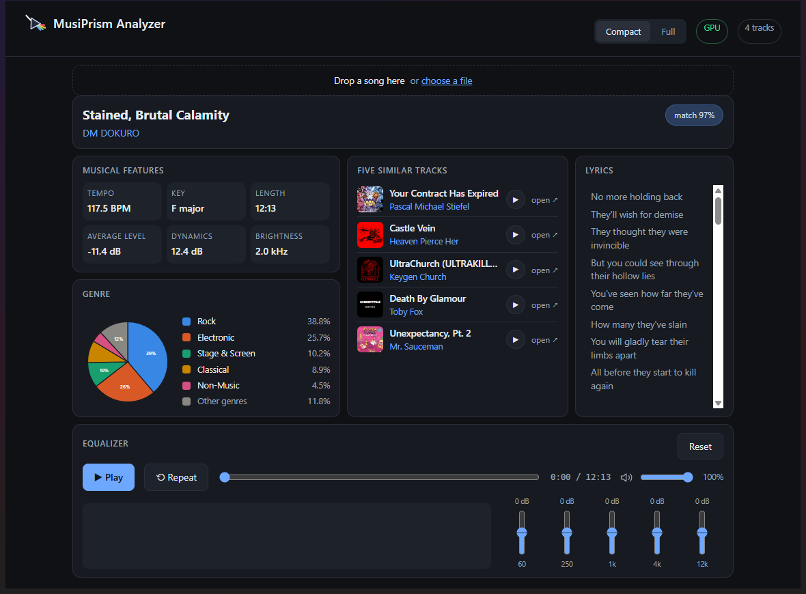
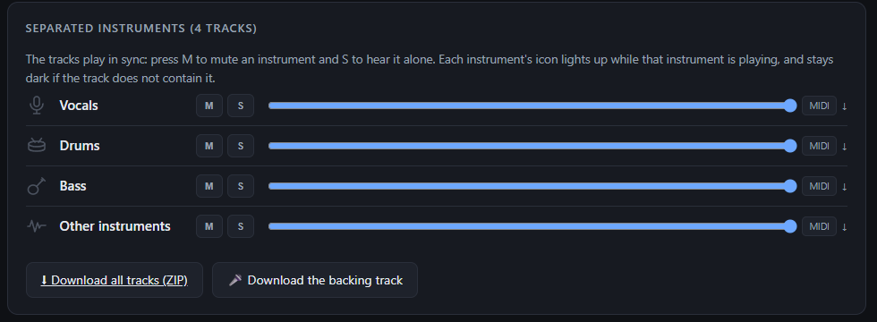
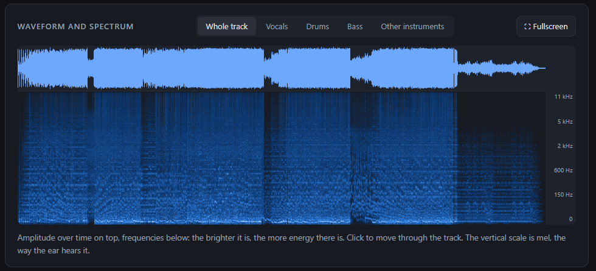

# MusiPrism Analyzer

**A prism splits light into its colours. This splits a song into its instruments.**

### ⬇ Download — one file, and it does the rest

Run it and it works out what your machine can actually use. If it finds an
NVIDIA card that can run the analysis, it asks whether you want to; if there is
no card, or the card is too old for it, it does not ask — it says why and takes
the edition that runs on the processor. That check is not "is there a card": a
GTX 1080 has perfectly good drivers and still cannot run any of this, so the
installer reads the card's compute capability and compares it with what is
inside the package. Then it downloads the right package, unpacks it and leaves
**MusiPrism Analyzer** in the Start menu. Python, the libraries, the separation
and genre models and ffmpeg all come with it: nothing else to install, nothing
to configure.

About 2.7 GB to download with an NVIDIA card (a minute per song) or 1.1 GB
without (about eight). Windows will warn that the installer is unsigned —
choose *More info → Run anyway*.

From then on it keeps itself up to date: on start it asks whether there is a
newer version and, if you say yes, replaces the application files — about a
hundred kilobytes — and restarts.

You load a song and the application breaks it down into the instruments that
make it up, measures its tempo and key, estimates its genre and — if the track
is catalogued — retrieves its artist and album.

It runs entirely on your computer: the audio is never uploaded to any external
service. The only network requests are the acoustic fingerprint lookup on
AcoustID and MusicBrainz (metadata only, not the audio) and the model downloads
on first start.

> This repository carries the **downloads and the updates**. The source code is
> in a private repository: release attachments of a private repository cannot be
> fetched without credentials, and a credential shipped inside a program anyone
> can download is a credential anyone can read — so the packages, and the update
> the app installs by itself, live out here.

## At a glance

- **Instrument separation** into 4, 6 or 8 stems with Demucs — and the stems sum
  back to the original track, 75 dB below it, so nothing is thrown away.
- **A mixer that plays them in sync**: mute one instrument, hear it alone,
  download it, or take the whole backing track without the vocals.
- **Tempo, key, dynamics and brightness**, measured from the signal, plus how
  tempo and key *change* over the track.
- **Song structure**: sections found on bar boundaries, with the repeated ones
  marked — that is how a chorus shows itself.
- **Genre** from MAEST, trained on the Discogs taxonomy of 400 styles.
- **Artist and album** from the Chromaprint fingerprint (AcoustID + MusicBrainz).
- **Synced lyrics** from LRCLIB, scrolling and highlighting as you listen.
- **Vocal range**, **MIDI transcription** of each stem, and **five similar
  tracks** from the recognised artist.

*The separated stems play together in sync — mute one, solo it, export it as MIDI.*

*Waveform and mel spectrogram, for the whole track or for a single instrument.*

## Download

**The installer** is 3 MB and carries none of the program: it works out which
edition you need, downloads it and unpacks it. It installs under your own user,
without asking for administrator rights — not to spare you the prompt, but
because the app rewrites its own files when it updates, and inside *Program
Files* it could not do that without asking every time. Uninstalling removes the
folder whole.

If a copy is already installed it says so, and where, and asks whether to go on.
Answering no ends the installation and changes nothing. Answering yes installs
over it, in the same folder: the new version is downloaded and unpacked first
and the old one removed only once it has arrived, so a download that fails
leaves you with the program you had. Your AcoustID key is carried across.

Behind it, the [latest release](https://github.com/czmblu/MusiPrism-Analyzer-releases/releases/latest)
carries **two ready-to-run packages**: Python, every library, the models and
ffmpeg are already inside them. Nothing else is installed on the computer and
nothing is downloaded on first start. Both do exactly the same things — they
differ only in whether they can use an NVIDIA card.

**NVIDIA edition** — 2.7 GB, about a minute per song, 6 GB unpacked. It is
attached in two `.7z` parts because GitHub refuses attachments over 2 GB; the
installer puts them back together, which is the reason it exists.

**CPU edition** — 1.1 GB, about eight minutes per song on a fast desktop
processor, 2.3 GB unpacked. Take this one if you have no NVIDIA card: the other
edition would work anyway, at the same speed, but you would be downloading 4 GB
of CUDA for nothing.

Both can also be downloaded by hand from the release and unpacked without the
installer — the folder they contain runs from anywhere, including a USB drive.
Windows may warn that these files are unsigned: choose *More info → Run anyway*.

Artist and album recognition stays off until you add a free AcoustID key — see
[The AcoustID key](#the-acoustid-key). Everything else works out of the box.

The timings are measured on the same two-minute song with six stems: about a
minute on an RTX 5070 Ti, 494 seconds on a Ryzen 7 7800X3D.

## Updating itself

On start the app asks the releases repository whether a newer version exists.
If there is one it says so — with what changed and how big the download is —
and installs it only if you agree. It takes about a second: the update carries
the **application files alone**, a hundred kilobytes, while Python, the
libraries and the models, which are the 2.7 GB of the package and which almost
no fix touches, stay where they are. The app then restarts by itself.

Your AcoustID key and the analyses on disk are left alone. If the download or
the copy fails, every replaced file is put back and the app keeps working as it
was. A copy running from the source is never touched — it carries a `.git`
folder, and overwriting it would throw away uncommitted work.

When a library or a model changes, that is a new package to download by hand
instead: the small update cannot carry 2.7 GB.

## Two views

**Compact** is the default one: it fits in a single screen, with no scrolling.
It contains the recognised track, its musical features, the genre as a pie
chart, the five similar tracks, the lyrics and the equalizer. The lyrics sit in
a narrow column on the right and scroll by themselves following playback,
without stretching the page; if the window narrows below 1010 px they go back to
the bottom, at full width.

**Full** adds the mixer of the separated stems and the representations of the
sound (waveform and spectrogram). You switch between them with the toggle at the
top right, and the choice is remembered.

Even in the compact view the separated stems are produced and loaded, just not
shown: they are the ones providing the audio, so without them the equalizer
would have nothing to act on. That is why the equalizer card carries a reduced
set of playback controls.

## What it does

**Instrument separation — 6 stems.** Vocals, drums, bass, guitar, piano, other
instruments, produced by `htdemucs_6s` in a single pass. On the page they play
in sync, with a mixer that lets you mute a single instrument (`M`), hear it
alone (`S`), adjust its volume and download it.

The playback controls and the volume sit in a **fixed bar at the top**, which
stays anchored while you scroll: the full view is a few thousand pixels long and
the mixer sits halfway down, so to press play you had to go looking for it. The
compact view has its own controls next to the equalizer instead.

Next to Play there is **⟲ Repeat**: switched on, when the track ends it starts
again from the beginning. The stems go back to zero all together, with the same
mechanism used for seeking, so they stay in sync on the restart. The two groups
of controls — the one in the top bar and the compact one — always show the same
state.

Every instrument has its own icon, which **lights up while that instrument is
playing** and stays dark when it is silent — with the strength of the glow
following the level, so an accent can be told from a held note. The level is not
measured in the browser while you listen, but computed on the server on the
full-resolution audio, twenty times per second, and saved together with the
stems.

An instrument entirely absent from the track is recognised as such — its icon
stays dark and dimmer — instead of blinking in time with the music on the bleed
of the other instruments, which in separated stems is always there.

The stems **sum back exactly to the original track**: the measured residual is
75 dB below the piece, that is inaudible. That is why "Other instruments" is
always there, even when it looks superfluous: it contains strings, brass,
synthesizers and everything the model cannot name.

The sum adding up is not automatic. The sources produced by Demucs leave a
residual out — reverb tails, transients, spectral tails that no source claims —
about **16 dB below the original**. On a single stem you do not notice it;
listening to them all together that hole is heard as a veil over the sound. The
app re-injects it into "other instruments", which is already the catch-all stem,
and the other five stay exactly as the model produced them. It can be turned off
with `REINJECT_RESIDUAL=0`.

**The vocals go through a second model.** `htdemucs_ft` is slower but more
precise on singing, and it is used for the vocal stem only; the rest stays with
the main model. The division of labour comes from a measurement made on the same
track: `htdemucs_ft` produces a more harmonic voice (0.43 against 0.40, that is
less bleed from cymbals and snare), and on a sung theme the measurement repeated
itself (0.791 against 0.784 and 0.773). Taking from each model what it is better
at gives the best of the two, and the difference between the two readings is
absorbed by the catch-all stem, so the sum stays exact. It is turned off with
`VOCE_RIFINITA=0`.

The other half of that measurement, though, did not hold up when tried on more
tracks: it looked as if `htdemucs_6s` held the bass better (79% against 74%),
but on a sung theme the opposite is true, and by a lot (42.8% against 66.7%). On
the bass, then, there is no better model: it depends on the track.

One underlying limit remains: the models are trained on music with a lead voice
in the foreground. On dense choirs, overlapping voices or distorted singing the
separation gets worse, and that is not a configuration fault.

The stems come out in **lossless FLAC**. On an isolated stem MP3 is heard far
more than on a full mix — cymbals lose their attack and in the near-silent
passages artefacts surface that in the whole track would be masked by the other
instruments. For the same duration, the FLAC of a separated stem does not weigh
more than a 320 kbps MP3, because silence compresses to almost nothing.

FLAC also has a practical advantage over MP3 for anyone putting the stems back
into a sequencer: no encoding delay. MP3 introduces about 1105 samples, 25
milliseconds, and the re-imported stems all come out shifted.

`DEMUCS_SHIFTS=2` runs the track twice with a random shift and averages the
result. Raising it further is not worth it: measured at 5 shifts and 0.75
overlap, the fidelity does not improve at all while the time goes from 2 to 23
seconds. They stayed configurable (`DEMUCS_SHIFTS`, `DEMUCS_OVERLAP`) but the
default values are the right ones.

With `STEM_COUNT=4` you only get vocals, drums, bass and the rest, and the model
changes too: not `htdemucs_6s` but `htdemucs`, which separates those four stems
better. Measured on two tracks, the residual no source claims drops from
−20.5 dB to −30.0 and from −22.2 to −37.5: with `6s`, three to five times more
signal ends up in the catch-all stem than should, instead of in a named one. On
a third track, a sung theme, the gap is the same (−19.1 against −29.6) and on
top of that `htdemucs` holds far more bass: 66.7% of the energy below 250 Hz
against 42.8%. `6s` is still needed as soon as guitar and piano are wanted,
being the only one that produces them.

With `STEM_COUNT=8` the drums go through a second model that splits them into
kick, snare, cymbals and toms: it works, but working on an already separated
signal it inherits its errors, so it is slower and dirtier.

**Five-band equalizer.** Sliders at 60 Hz, 250 Hz, 1 kHz, 4 kHz and 12 kHz, from
−12 to +12 dB, acting on the overall output. Above them, the bars show in real
time the spectrum of what you are hearing, grouped on a logarithmic scale: on a
linear scale three quarters of the bars would end up above 10 kHz, where in
music almost nothing happens.

The equalizer requires routing the audio through the browser's sound engine. It
is the point where, if something goes wrong, the stems would stay silent: for
that reason the engine is created and checked **before** anything is connected
to it, and if it does not start the app gives up the equalizer instead of
risking silence. In that case it says so under the sliders.

**Waveform and spectrogram.** Amplitude over time on top, frequencies below,
aligned on the same axis with a playhead following playback; clicking moves you
through the track. It starts from the whole-track view and you can switch to
each single instrument.

The **Fullscreen** button — or a double click on the image — brings the
spectrogram to the whole monitor, and `Esc` brings it back. It is not a
gimmick: in the card the spectrogram is 220 pixels tall, fullscreen almost a
thousand, and on a spectrogram the height decides how many frequency bands stay
distinguishable. Harmonics and attacks that in the card are one smear can be
read one by one at full screen.

Fullscreen requested from inside the page would only fill the content area,
because WebView2 cannot enlarge the window hosting it: the request is therefore
passed to the application shell, which enlarges the real window. In the browser
version the standard fullscreen applies instead.

The frequencies are on a mel scale, not a linear one: it mirrors the way the ear
perceives them, and without it the first few pixels at the bottom would contain
almost all the music and the rest would be empty. The brightness follows a curve
with exponent 1.6, tuned by looking at the image: on a linear scale music
saturates within the 40 dB below the peak and the spectrogram comes out a
uniform light blue, showing neither harmonics nor attacks.

The spectrogram of the track is generated during the analysis; those of the
single stems only when you open them, in about three tenths of a second, so as
not to pay for six images that often nobody looks at.

**Tempo, key, dynamics.** Measured directly from the signal, with no models:
BPM, key (with the confidence index of the estimate), average level, dynamic
range and spectral brightness.

**Genre, as bars or as a pie.** Estimated with MAEST, a transformer trained on
the Discogs taxonomy of 400 styles. The prediction is the average over several
30-second chunks, so that an isolated chorus or solo does not determine the
result on its own.

Bars are the default view because comparing aligned lengths is more precise than
comparing angles; the pie answers a different question — how much each genre
weighs on the whole — and always includes the "Other genres" slice. Without that
remainder the top five genres would cover about 80% of the score but would be
drawn as if they were 100%, showing inflated proportions.

**Artist and album.** Chromaprint acoustic fingerprint, looked up on AcoustID
and enriched with MusicBrainz metadata.

**Synced lyrics.** From LRCLIB, an open archive with no key: the lines arrive
with their timestamp and scroll along, highlighting themselves as you listen.
Clicking a line jumps to that point of the track. The track has to have been
recognised, because lyrics are looked up by artist and title; between two
recordings of the same piece the one closest in length is chosen, and if a
sizeable gap remains it is declared.

**Track structure.** The boundaries are looked for **on the bars**, not on
arbitrary frames: in music a part does not end halfway through a bar, and a
boundary placed anywhere lets the tail of a section spill into the next one.
Measured side by side, aligning the boundaries to the beat and adding harmony to
timbre makes the parts 16% more distinct from each other on an orchestral track
and 69% on a sung one.

Parts that resemble each other receive the same letter: that is how a chorus
coming back is recognised, without knowing it in advance. The section taking up
the most minutes overall is highlighted — usually it is the chorus, and it is
labelled as such without renaming the others by guesswork. If the track is too
uniform, the app declares that it did not detect a structure instead of showing
one single band.

**Tempo and key over time.** A track slows down, speeds up and modulates: a
single number flattens it. The tempo curve brings every estimate back to the
octave of the overall one, otherwise it would jump between 86 and 172 BPM on a
piece that never changed pace. Key changes are only shown if they last: one
appearing in a single window is a passing chord.

**Vocal range.** Lowest and highest note actually sung, with the range in
octaves — to know whether a piece sits in your own tessitura. The two extreme
percentiles are discarded, otherwise a breath or an isolated off note would
widen the range by an octave.

**MIDI transcription.** Every separated stem can be transcribed into notes and
downloaded as a MIDI file, to be opened in a sequencer. It works precisely
because the stems are separated: the model's authors write that it "works best
on one instrument at a time".

**Backing track.** All the stems summed except the vocal one, downloadable with
one click. It is not an extra file produced by the analysis but the sum of the
ones already there.

**Comparison between two tracks.** Two analyses from the same session side by
side on tempo, key, length, genre, level, dynamics and brightness, with the
differences highlighted.

**Five similar tracks.** From the recognised artist it walks, through Deezer's
public APIs, to the related artists, and from each takes the most listened
track: five different artists give five varied recommendations instead of five
pieces from the same record. Every recommendation has cover art, a 30-second
preview playable in the page and a link to the track.

If the track is not recognised you can type artist and title by hand, so the
recommendations work even without the AcoustID key.

## The AcoustID key

Artist and album recognition is the only feature that needs configuration. The
key is **free and unlimited**:

1. register at <https://acoustid.org/new-application>;
2. copy the key you get;
3. paste it into the `.env` file, under `ACOUSTID_API_KEY=`;
4. restart the server.

Without a key everything else works normally: the track card simply reports that
recognition is off.

## Limits worth knowing

**Track recognition is not artificial intelligence**, but the comparison of a
fingerprint against an archive. Two concrete consequences follow:

- it recognises the *exact recording*, not the song in the abstract: covers,
  live performances and remixes are almost never found, even if the original
  track is extremely well known;
- a track missing from the archive will never be identified, however famous.

**The genre predicted by the model is a statistical estimate**, not a fact. When
the track is recognised, the application shows the genres declared in the
metadata — those are real information — and keeps the model prediction next to
them, as a comparison.

**The BPM can come out halved or doubled.** It is a typical error of every tempo
detector. The value is brought back into the 70–160 BPM range and, when the
correction kicks in, the card also reports the raw reading.

**The key is ambiguous between relative majors and minors** (C major and A minor
share the same notes). The confidence index next to the estimate flags the
uncertain cases.

**Recommendations start from the artist, not from the sound.** There is no way
to deduce from the audio that one song resembles another without a catalogue to
compare it against: what is used here is what people actually listen to. It
follows that the recommendations are worth as much as the artist's popularity in
the Deezer catalogue, and that **they do not work on classical music**: there
the catalogued name is the performer's, not the composer's. In that case the app
says it found nothing instead of making things up: an artist matched by mistake
produces five wrong recommendations with the same confidence as five right ones.

**Telling whether there is a singer is not trivial.** In an instrumental track
the vocal stem is not empty: it contains the bleed of the other instruments, and
measuring its pitch would give three octaves of range to a voice that never
sang. Telling them apart by pitch continuity was tried, and it was measured not
to work: on an orchestral track the bleed produces pitched runs of 0.37 s
against the 0.33 s of a real voice. The only reliable indicator is the level — a
voice that is present sits a few decibels from the instruments, the two
instrumental tracks tried sat 24 and 30 dB below — and between 12 and 18 dB the
result is shown while declaring the uncertainty.

**Instrument separation is always approximate.** Guitar and piano are the
weakest stems — they are the latest additions to Demucs — and on dense tracks
you hear residues of the other instruments. Vocals, bass and drums are clearly
cleaner.

## Requirements and performance

- Python 3.12, ffmpeg, NVIDIA GPU optional but recommended.
- On an RTX 5070 Ti a two-minute track is analysed in full, 6 stems included, in
  about twenty seconds; a twelve-minute one in a little over three. Without a
  graphics card it goes up to several minutes.
- The FLAC stems of a long track are heavy: about 100 MB each for twelve
  minutes, so over half a gigabyte per track in the session cache. They are
  deleted on close anyway.
- On first start it downloads the models (~330 MB for the genre, ~300 MB for
  htdemucs_6s), then everything stays cached. The drum model (~160 MB) is only
  downloaded if `STEM_COUNT=8` is set.

NVIDIA 50-series cards (Blackwell) require the PyTorch builds for CUDA 12.8: the
default ones on PyPI do not support them and would silently fall back to the
CPU.

## The cache lasts as long as the session

Analyses are kept in `data\results\` while the app is open, and **deleted on
close**. They are a few tens of MB per track — the six FLAC stems of a
four-minute piece sit around 50-70 MB — and keeping them would fill the disk
with files nobody will reopen.

While the app stays open, loading the same track again does not re-analyse it:
the result comes back instantly. The comparison is on the content of the file,
not on its name, so the same piece renamed or taken from another folder reuses
the work already done anyway. The track card says so when it happens.

The cleanup also runs at startup, to remove whatever is left after an abnormal
close. **The downloaded models are not touched**: they are about 600 MB in
`~\.cache\huggingface` and they are needed at every later start.

## License

**Free to use, not to pass on.** Install it on any computer you own and use it
for as long as you like, at no charge. What you may not do, without asking
first, is give it to anyone else — publish it, upload it, share it, sell it, or
bundle it with something else, whole or in part, original or modified, installer
or package or the source code inside it. See [LICENSE](LICENSE).

Everything it carries — Python, PyTorch, Demucs, the models, ffmpeg,
Chromaprint — keeps its own licence, and this one takes nothing away from those.
Two of them are worth knowing about: the bundled **ffmpeg is a GPL-3.0 build**,
and the **genre model is CC BY-NC-SA 4.0**, which means the package cannot be
used commercially. [THIRD-PARTY-NOTICES.md](THIRD-PARTY-NOTICES.md) lists what
is inside, under what terms, and where its source lives.

Releases up to 1.0.1 were MIT, and whoever took a copy under those terms keeps
what MIT gave them for it: a licence already granted cannot be withdrawn.
